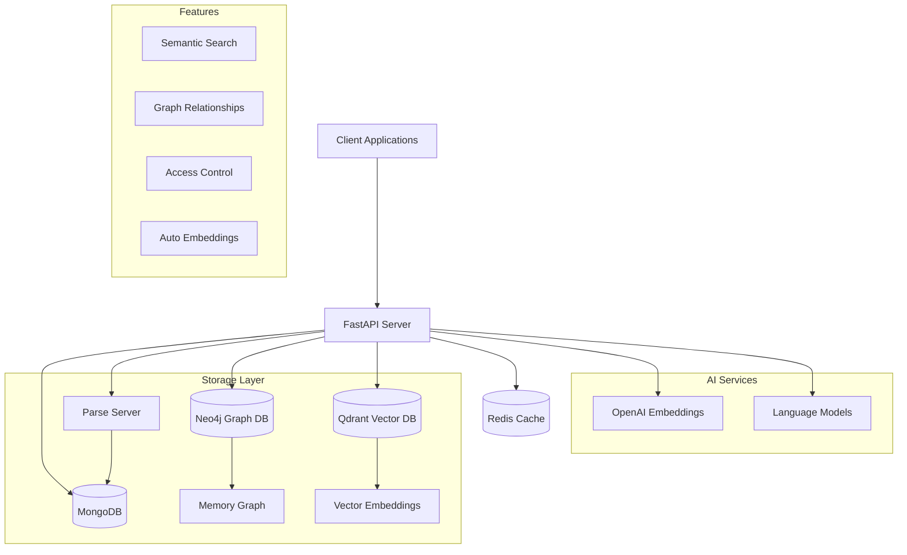
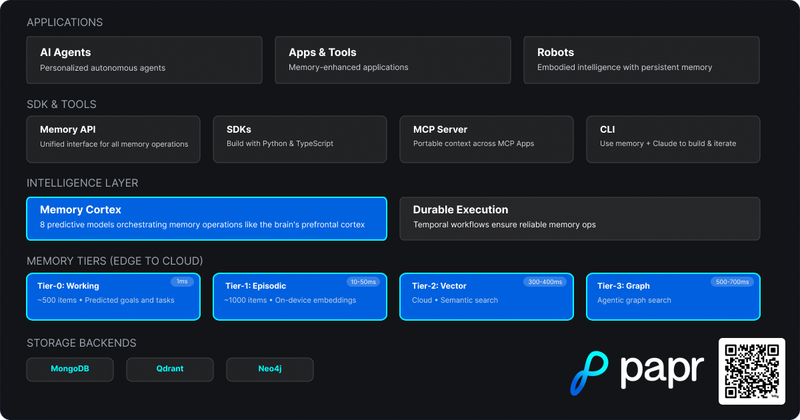

# Papr Memory 🧠

> **Predictive memory layer for AI agents.** MongoDB + Qdrant + Neo4j with multi-tier caching, custom schema support & GraphQL. 91% Stanford STARK accuracy, <100ms on-device retrieval.

[](https://www.gnu.org/licenses/agpl-3.0)
[](https://www.python.org/downloads/)
[](https://fastapi.tiangolo.com/)

## 🚀 What is Papr Memory?

Papr Memory is the predictive memory layer for your AI agents that allows you to:

- **Store Information**: Save text, documents, code snippets, and structured data
- **AI-Powered Search**: Find relevant memories using natural language queries
- **Graph Relationships**: Automatically discover and track connections between memories
- **Vector Embeddings**: Semantic search powered by modern embedding models
- **Multi-Modal Support**: Handle text, documents, images, and structured data
- **User Context**: Personal memory spaces with fine-grained access control

### 💡 Use Cases

- **Voice Agents for Customer Support**: Enable intelligent voice assistants with persistent memory and context
- **B2B AI Agents**: Knowledge management, RAG, and semantic search for enterprise applications
- **Coding Agents**: Use custom ontology + GraphQL for significant improvements to context and search in your codebase
- **Financial AI Agents**: Ingest financial documents using custom ontology + GraphQL for queries
- **Healthcare AI Agents**: Secure, compliant memory management for healthcare applications
- **Retail AI Agents**: Use custom ontology + GraphQL for intelligent product recommendations and customer insights

## 🏗️ Architecture Overview



## Predictive memory Architecture



## 🆚 Open Source vs Cloud

| Feature | Open Source | Cloud |
|---------|-------------|-------|
| Memory Storage | ✅ | ✅ |
| Vector Search | ✅ | ✅ |
| Graph Relationships | ✅ | ✅ |
| API Access | ✅ | ✅ |
| Self-Hosted | ✅ | ❌ |
| Managed Infrastructure | ❌ | ✅ |
| Automatic Backups | ❌ | ✅ |
| Payment/Billing | ❌ | ✅ |
| Enterprise SSO | ❌ | ✅ |
| SLA Guarantees | ❌ | ✅ |
| Priority Support | ❌ | ✅ |
| Advanced Analytics | ❌ | ✅ |
| Document Ingestion with Durable Execution | ❌ | ✅ |
| GraphQL Instance with Custom Ontology | ❌ | ✅ |
| On-Device Predictions (< 100ms retrieval) | ❌ | ✅ |

### 🔧 Key Components

- **FastAPI Server**: Main API layer with authentication and routing
- **Parse Server**: User management, ACL, and structured data storage
- **MongoDB**: Primary document storage and user data
- **Neo4j**: Graph database for memory relationships and connections
- **Qdrant**: Vector database for semantic search and embeddings
- **Redis**: Caching layer for performance optimization

## 🚀 Quick Start

### Prerequisites

- **Python 3.8+**
- **Docker & Docker Compose** (recommended)
- **Git**
- **API Keys**: OpenAI API key, Groq API key, and Deep Infra API key
  - Note: Hugging Face is also supported, and local Qwen on-device support will be added soon

### Option 1: Docker Setup (Recommended)

**For Open Source Setup**, see the detailed guide: **[QUICKSTART_OPENSOURCE.md](QUICKSTART_OPENSOURCE.md)**

Quick start:

1. **Clone the repository**
```bash
git clone https://github.com/Papr-ai/memory-opensource.git
cd memory-opensource
```

2. **Copy environment configuration**
```bash
# For open source setup
cp .env.example .env.opensource
# Edit .env.opensource with your API keys (OpenAI, Groq, Deep Infra)
# Note: Hugging Face is also supported, and local Qwen on-device support will be added soon
```

3. **Start all services**
```bash
# Open source setup (auto-initializes everything)
docker-compose up -d
```

4. **Access the API**
   - API Documentation: http://localhost:5001/docs
   - Health Check: http://localhost:5001/health
   - Parse Dashboard: http://localhost:4040 (optional, use `--profile dashboard` for open source)
   
**Note**: The open-source setup automatically initializes schemas, creates a default user, and generates an API key on first run. Check container logs for your API key.

### Option 2: Manual Setup

1. **Clone and setup Python environment**
```bash
git clone https://github.com/Papr-ai/memory-opensource.git
cd memory-opensource
python -m venv venv
source venv/bin/activate  # On Windows: venv\Scripts\activate
pip install -r requirements.txt
```

2. **Start required services**
```bash
# Recommended: Use docker-compose for open source setup
docker-compose up -d mongodb neo4j qdrant redis parse-server

# Or start individually (for development):
# MongoDB
docker run -d -p 27017:27017 --name mongo mongo:8.0.12

# Neo4j
docker run -d -p 7474:7474 -p 7687:7687 \
  -e NEO4J_AUTH=neo4j/password \
  --name neo4j neo4j:2025.10.1

# Qdrant
docker run -d -p 6333:6333 --name qdrant qdrant/qdrant:v1.16.0

# Redis
docker run -d -p 6379:6379 --name redis redis:7-alpine

# Parse Server
docker run -d -p 1337:1337 \
  -e PARSE_SERVER_APPLICATION_ID=papr-oss-app-id \
  -e PARSE_SERVER_MASTER_KEY=papr-oss-master-key \
  -e PARSE_SERVER_DATABASE_URI=mongodb://localhost:27017/papr_memory \
  --name parse parseplatform/parse-server:8.4.0
```

3. **Configure environment**
```bash
# For open source
cp .env.example .env.opensource
# Edit .env.opensource with your service URLs and API keys

# For cloud/development
cp .env.example .env
# Edit .env with your service URLs and API keys
```

4. **Run the application**
```bash
python main.py
```

## 📖 API Documentation

### Authentication

The API supports multiple authentication methods:

```bash
# API Key
curl -H "X-API-Key: your-api-key" http://localhost:5001/v1/memory

# Session Token
curl -H "X-Session-Token: your-session-token" http://localhost:5001/v1/memory

# Bearer Token (OAuth)
curl -H "Authorization: Bearer your-jwt-token" http://localhost:5001/v1/memory
```

### Core Endpoints

#### Memory Management
```bash
# Add a memory
POST /v1/memory
{
  "content": "Your memory content",
  "type": "text",
  "metadata": {
    "tags": ["important", "work"],
    "location": "office"
  }
}

# Search memories
POST /v1/memory/search
{
  "query": "find relevant information",
  "max_memories": 10
}

# Get specific memory
GET /v1/memory/{memory_id}

# Update memory
PUT /v1/memory/{memory_id}

# Delete memory
DELETE /v1/memory/{memory_id}
```

#### Document Upload
```bash
# Upload document
POST /v1/documents
Content-Type: multipart/form-data
File: document.pdf
```

#### User Management
```bash
# Get user info
GET /v1/users/me

# Update user settings
PUT /v1/users/me
```

### Interactive API Documentation

Once running, visit:
- **Swagger UI**: http://localhost:5001/docs
- **ReDoc**: http://localhost:5001/redoc
- **OpenAPI Schema**: http://localhost:5001/openapi.json

## 🔧 Configuration

### Environment Variables

Key environment variables (see `.env.example` for complete list):

```bash
# Server Configuration
PORT=5001
DEBUG=true
ENVIRONMENT=development

# Database URLs
MONGODB_URL=mongodb://localhost:27017/papr_memory
NEO4J_URL=bolt://localhost:7687
QDRANT_URL=http://localhost:6333
REDIS_URL=redis://localhost:6379

# Parse Server
PARSE_SERVER_URL=http://localhost:1337
PARSE_SERVER_APP_ID=your-app-id
PARSE_SERVER_MASTER_KEY=your-master-key

# AI Services
OPENAI_API_KEY=your-openai-key
OPENAI_ORGANIZATION=your-org-id
GROQ_API_KEY=your-groq-key
DEEPINFRA_API_KEY=your-deepinfra-key
# Note: Hugging Face is also supported, and local Qwen on-device support will be added soon
```

### Advanced Configuration

- **Vector Search**: Configure embedding models and search parameters
- **Graph Relationships**: Customize relationship extraction and graph building
- **Access Control**: Setup user roles and permissions
- **Caching**: Configure Redis caching strategies
- **Monitoring**: Setup logging and health checks

## 🧪 Testing

### Run Tests
```bash
# All tests
pytest

# Specific test categories
pytest tests/unit/
pytest tests/integration/
pytest tests/api/

# With coverage
pytest --cov=./ --cov-report=html
```

### API Testing
```bash
# Health check
curl http://localhost:5001/health

# Test authentication
curl -H "X-API-Key: test-key" http://localhost:5001/v1/memory

# Test memory creation
curl -X POST -H "Content-Type: application/json" \
  -H "X-API-Key: test-key" \
  -d '{"content":"Test memory","type":"text"}' \
  http://localhost:5001/v1/memory
```

## 📚 Examples

### Python Client
```python
import requests

# Initialize client
base_url = "http://localhost:5001"
headers = {"X-API-Key": "your-api-key"}

# Add memory
response = requests.post(
    f"{base_url}/v1/memory",
    json={
        "content": "Important meeting notes from today",
        "type": "text",
        "metadata": {
            "tags": ["meeting", "work"],
            "date": "2024-01-15"
        }
    },
    headers=headers
)
memory = response.json()

# Search memories
response = requests.post(
    f"{base_url}/v1/memory/search",
    json={"query": "meeting notes", "max_memories": 10},
    headers=headers
)
results = response.json()
```

### JavaScript Client
```javascript
const baseUrl = 'http://localhost:5001';
const headers = { 'X-API-Key': 'your-api-key' };

// Add memory
const addMemory = async (content, metadata = {}) => {
  const response = await fetch(`${baseUrl}/v1/memory`, {
    method: 'POST',
    headers: { ...headers, 'Content-Type': 'application/json' },
    body: JSON.stringify({ content, type: 'text', metadata })
  });
  return response.json();
};

// Search memories
const searchMemories = async (query) => {
  const response = await fetch(`${baseUrl}/v1/memory/search`, {
    method: 'POST',
    headers: { ...headers, 'Content-Type': 'application/json' },
    body: JSON.stringify({ query, max_memories: 10 })
  });
  return response.json();
};
```

## 🤝 Contributing

We welcome contributions! Please see [CONTRIBUTING.md](CONTRIBUTING.md) for guidelines.

### Quick Contribution Steps
1. Fork the repository
2. Create a feature branch: `git checkout -b feature/your-feature`
3. Make your changes and add tests
4. Run tests: `pytest`
5. Commit your changes: `git commit -am 'Add some feature'`
6. Push to the branch: `git push origin feature/your-feature`
7. Submit a pull request

## 📄 License

This project is licensed under the GNU Affero General Public License v3.0 - see the [LICENSE](LICENSE) file for details.

## 🆘 Support

- **Documentation**: Check the [API docs](http://localhost:5001/docs) and this README
- **Issues**: [GitHub Issues](https://github.com/Papr-ai/memory-opensource/issues)
- **Discussions**: [GitHub Discussions](https://github.com/Papr-ai/memory-opensource/discussions)
- **Discord**: Join our community for real-time support: https://discord.gg/sWpR5a3H

## 🗺️ Roadmap

- [ ] **Enhanced Graph Relationships**: Automatic relationship extraction from content
- [ ] **Multi-Modal Support**: Image and audio memory storage
- [ ] **Advanced Search**: Hybrid search combining vector and graph traversal
- [ ] **Real-time Collaboration**: Live memory sharing and editing
- [ ] **Mobile SDK**: Native mobile app integration
- [ ] **Enterprise Features**: Advanced ACL, audit logs, and compliance
- [ ] **MongoDB Migration**: Remove Parse Server dependency (planned)

---

**Built with ❤️ by the Papr team**