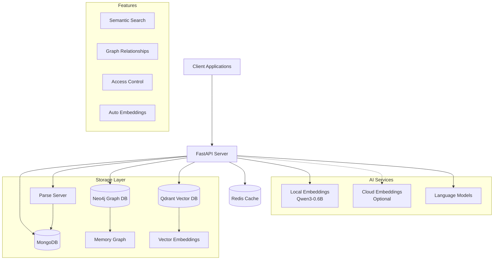

# Papr Memory 🧠

> **Predictive memory layer for AI agents.** MongoDB + Qdrant + Neo4j with multi-tier caching, custom schema support & GraphQL. 91% Stanford STARK accuracy, <100ms on-device retrieval.

[](https://www.gnu.org/licenses/agpl-3.0)
[](https://www.python.org/downloads/)
[](https://fastapi.tiangolo.com/)

## 🚀 What is Papr Memory?

Papr Memory is the predictive memory layer for your AI agents that allows you to:

- **Store Information**: Save text, documents, code snippets, and structured data
- **AI-Powered Search**: Find relevant memories using natural language queries
- **Graph Relationships**: Automatically discover and track connections between memories
- **Vector Embeddings**: Semantic search powered by modern embedding models
- **Multi-Modal Support**: Handle text, documents, images, and structured data
- **User Context**: Personal memory spaces with fine-grained access control

### 💡 Use Cases

- **Voice Agents for Customer Support**: Enable intelligent voice assistants with persistent memory and context
- **B2B AI Agents**: Knowledge management, RAG, and semantic search for enterprise applications
- **Coding Agents**: Use custom ontology + GraphQL for significant improvements to context and search in your codebase
- **Financial AI Agents**: Ingest financial documents using custom ontology + GraphQL for queries
- **Healthcare AI Agents**: Secure, compliant memory management for healthcare applications
- **Retail AI Agents**: Use custom ontology + GraphQL for intelligent product recommendations and customer insights

## 🏗️ Architecture Overview



## Predictive memory Architecture


## 🆚 Open Source vs Cloud

| Feature | Open Source | Cloud |
|---------|-------------|-------|
| Memory Storage | ✅ | ✅ |
| Vector Search | ✅ | ✅ |
| **Local Embeddings (Privacy-First)** | **✅** | **❌** |
| Graph Relationships | ✅ | ✅ |
| API Access | ✅ | ✅ |
| Self-Hosted | ✅ | ❌ |
| Managed Infrastructure | ❌ | ✅ |
| Automatic Backups | ❌ | ✅ |
| Payment/Billing | ❌ | ✅ |
| Enterprise SSO | ❌ | ✅ |
| SLA Guarantees | ❌ | ✅ |
| Priority Support | ❌ | ✅ |
| Advanced Analytics | ❌ | ✅ |
| Document Ingestion with Durable Execution | ❌ | ✅ |
| GraphQL Instance with Custom Ontology | ❌ | ✅ |
| On-Device Predictions (< 100ms retrieval) | ❌ | ✅ |

### 🔧 Key Components

- **FastAPI Server**: Main API layer with authentication and routing
- **Parse Server**: User management, ACL, and structured data storage
- **MongoDB**: Primary document storage and user data
- **Neo4j**: Graph database for memory relationships and connections
- **Qdrant**: Vector database for semantic search and embeddings
- **Redis**: Caching layer for performance optimization
- **Local Embeddings**: Privacy-first Qwen3-0.6B model for on-device embedding generation (see [Local Embeddings Guide](docs/LOCAL_EMBEDDINGS.md))

## 🚀 Quick Start

### Prerequisites

- **Python 3.8+**
- **Docker & Docker Compose** (recommended)
- **Git**
- **API Keys** (Optional for local embeddings):
  - OpenAI API key (for LLM operations)
  - Groq API key (optional)
  - Deep Infra API key (only if using cloud embeddings)

#### Docker Resource Requirements

**Important:** Docker resource allocation depends on your embedding choice:

##### Option 1: Local Embeddings (Default - Privacy-First) ✅

Local embeddings run the Qwen3-Embedding-0.6B model entirely on your device without external API calls.

| Resource | Minimum | Recommended | Notes |
|----------|---------|-------------|-------|
| **Memory (RAM)** | 8 GB | 12 GB | Model needs ~2-3 GB + services need ~2-3 GB |
| **CPU Cores** | 2 cores | 4+ cores | More cores = faster embedding generation |
| **Swap** | 2 GB | 4 GB | Helps prevent OOM during model loading |
| **Disk Space** | 10 GB | 20 GB | Model download ~1.2 GB + containers + data |

**To configure Docker resources (Docker Desktop):**
1. Open Docker Desktop → Settings → Resources
2. Set Memory to **at least 8 GB** (12 GB recommended)
3. Set CPUs to **4 or more** if available
4. Set Swap to **2-4 GB**
5. Click "Apply & Restart"

##### Option 2: Cloud Embeddings (Faster, Requires API)

Cloud embeddings use external APIs (DeepInfra/Vertex AI) - much lighter resource requirements.

| Resource | Minimum | Recommended |
|----------|---------|-------------|
| **Memory (RAM)** | 4 GB | 6 GB |
| **CPU Cores** | 2 cores | 4 cores |
| **Swap** | 1 GB | 2 GB |
| **Disk Space** | 5 GB | 10 GB |

**To use cloud embeddings**, set in your `.env` file:
```bash
USE_LOCAL_EMBEDDINGS=false
DEEPINFRA_TOKEN=your_token_here
```

See [Local Embeddings Guide](docs/LOCAL_EMBEDDINGS.md) for detailed comparison and configuration.

### Option 1: Docker Setup (Recommended)

**For Open Source Setup**, see the detailed guide: **[QUICKSTART_OPENSOURCE.md](QUICKSTART_OPENSOURCE.md)**

Quick start:

1. **Clone the repository**
```bash
git clone https://github.com/Papr-ai/memory-opensource.git
cd memory-opensource
```

2. **Copy environment configuration**
```bash
# For open source setup
cp .env.example .env.opensource
# Edit .env.opensource with your API keys

# OpenAI API key (required for LLM operations)
# Groq API key (optional)
# DeepInfra token (only needed if using cloud embeddings: USE_LOCAL_EMBEDDINGS=false)
# Note: By default, local embeddings are used (no external API calls)
```

3. **Start all services**
```bash
# Open source setup (auto-initializes everything)
docker compose up -d
```

4. **Access the API**
   - API Documentation: http://localhost:5001/docs
   - Health Check: http://localhost:5001/health
   - Parse Dashboard: http://localhost:4040 (optional, use `--profile dashboard` for open source)
   
**Note**: The open-source setup automatically initializes schemas, creates a default user, and generates an API key on first run. **Test credentials are automatically saved to your `.env.opensource` file** - check the `TEST_*` variables after the first startup completes (~30 seconds).

### Option 2: Manual Setup

1. **Clone and setup Python environment**
```bash
git clone https://github.com/Papr-ai/memory-opensource.git
cd memory-opensource
python -m venv venv
source venv/bin/activate  # On Windows: venv\Scripts\activate
pip install -r requirements.txt
```

2. **Start required services**
```bash
# Recommended: Use docker-compose for open source setup
docker compose up -d mongodb neo4j qdrant redis parse-server

# Or start individually (for development):
# MongoDB
docker run -d -p 27017:27017 --name mongo mongo:8.0.12

# Neo4j
docker run -d -p 7474:7474 -p 7687:7687 \
  -e NEO4J_AUTH=neo4j/password \
  --name neo4j neo4j:2025.10.1

# Qdrant
docker run -d -p 6333:6333 --name qdrant qdrant/qdrant:v1.16.0

# Redis
docker run -d -p 6379:6379 --name redis redis:7-alpine

# Parse Server
docker run -d -p 1337:1337 \
  -e PARSE_SERVER_APPLICATION_ID=papr-oss-app-id \
  -e PARSE_SERVER_MASTER_KEY=papr-oss-master-key \
  -e PARSE_SERVER_DATABASE_URI=mongodb://localhost:27017/papr_memory \
  --name parse parseplatform/parse-server:8.4.0
```

3. **Configure environment**
```bash
# For open source
cp .env.example .env.opensource
# Edit .env.opensource with your service URLs and API keys

# For cloud/development
cp .env.example .env
# Edit .env with your service URLs and API keys
```

4. **Run the application**
```bash
python main.py
```

## 📖 API Documentation

### Authentication

The API supports multiple authentication methods:

```bash
# API Key
curl -H "X-API-Key: your-api-key" http://localhost:5001/v1/memory

# Session Token
curl -H "X-Session-Token: your-session-token" http://localhost:5001/v1/memory

# Bearer Token (OAuth)
curl -H "Authorization: Bearer your-jwt-token" http://localhost:5001/v1/memory
```

### Core Endpoints

#### Memory Management
```bash
# Add a memory
POST /v1/memory
{
  "content": "Your memory content",
  "type": "text",
  "metadata": {
    "tags": ["important", "work"],
    "location": "office"
  }
}

# Search memories
POST /v1/memory/search
{
  "query": "find relevant information",
  "max_memories": 10
}

# Get specific memory
GET /v1/memory/{memory_id}

# Update memory
PUT /v1/memory/{memory_id}

# Delete memory
DELETE /v1/memory/{memory_id}
```

#### Document Upload
```bash
# Upload document
POST /v1/documents
Content-Type: multipart/form-data
File: document.pdf
```

#### User Management
```bash
# Get user info
GET /v1/users/me

# Update user settings
PUT /v1/users/me
```

### Interactive API Documentation

Once running, visit:
- **Swagger UI**: http://localhost:5001/docs
- **ReDoc**: http://localhost:5001/redoc
- **OpenAPI Schema**: http://localhost:5001/openapi.json

## 🔧 Configuration

### Environment Variables

Key environment variables (see `.env.example` for complete list):

```bash
# Server Configuration
PORT=5001
DEBUG=true
ENVIRONMENT=development

# Database URLs
MONGODB_URL=mongodb://localhost:27017/papr_memory
NEO4J_URL=bolt://localhost:7687
QDRANT_URL=http://localhost:6333
REDIS_URL=redis://localhost:6379

# Parse Server
PARSE_SERVER_URL=http://localhost:1337
PARSE_SERVER_APP_ID=your-app-id
PARSE_SERVER_MASTER_KEY=your-master-key

# AI Services
OPENAI_API_KEY=your-openai-key
OPENAI_ORGANIZATION=your-org-id
GROQ_API_KEY=your-groq-key
DEEPINFRA_API_KEY=your-deepinfra-key
# Note: Hugging Face is also supported, and local Qwen on-device support will be added soon
```

### Advanced Configuration

- **Vector Search**: Configure embedding models and search parameters
- **Graph Relationships**: Customize relationship extraction and graph building
- **Access Control**: Setup user roles and permissions
- **Caching**: Configure Redis caching strategies
- **Monitoring**: Setup logging and health checks

## 🧪 Testing

### Run Tests
```bash
# All tests
pytest

# Specific test categories
pytest tests/unit/
pytest tests/integration/
pytest tests/api/

# With coverage
pytest --cov=./ --cov-report=html
```

### API Testing
```bash
# Health check
curl http://localhost:5001/health

# Test authentication
curl -H "X-API-Key: test-key" http://localhost:5001/v1/memory

# Test memory creation
curl -X POST -H "Content-Type: application/json" \
  -H "X-API-Key: test-key" \
  -d '{"content":"Test memory","type":"text"}' \
  http://localhost:5001/v1/memory
```

## 📚 Examples

### Python Client
```python
import requests

# Initialize client
base_url = "http://localhost:5001"
headers = {"X-API-Key": "your-api-key"}

# Add memory
response = requests.post(
    f"{base_url}/v1/memory",
    json={
        "content": "Important meeting notes from today",
        "type": "text",
        "metadata": {
            "tags": ["meeting", "work"],
            "date": "2024-01-15"
        }
    },
    headers=headers
)
memory = response.json()

# Search memories
response = requests.post(
    f"{base_url}/v1/memory/search",
    json={"query": "meeting notes", "max_memories": 10},
    headers=headers
)
results = response.json()
```

### JavaScript Client
```javascript
const baseUrl = 'http://localhost:5001';
const headers = { 'X-API-Key': 'your-api-key' };

// Add memory
const addMemory = async (content, metadata = {}) => {
  const response = await fetch(`${baseUrl}/v1/memory`, {
    method: 'POST',
    headers: { ...headers, 'Content-Type': 'application/json' },
    body: JSON.stringify({ content, type: 'text', metadata })
  });
  return response.json();
};

// Search memories
const searchMemories = async (query) => {
  const response = await fetch(`${baseUrl}/v1/memory/search`, {
    method: 'POST',
    headers: { ...headers, 'Content-Type': 'application/json' },
    body: JSON.stringify({ query, max_memories: 10 })
  });
  return response.json();
};
```

## 🧪 Testing

The project includes a comprehensive test suite with **~119 V1 endpoint tests** covering memory operations, search, user management, and more.

### Run All Tests

```bash
# Simple one-command execution (works for all contributors)
./run_tests.sh
```

This automatically:
- ✅ Runs complete V1 test suite in Docker
- ✅ Saves reports to `tests/test_reports/`
- ✅ Works regardless of Docker configuration
- ✅ Displays summary when complete

### Run Single Test

```bash
# Debug a specific failing test
./tests/run_single_test.sh "tests/test_add_memory_fastapi.py::test_v1_add_memory_1"
```

### View Test Results

```bash
# View latest test summary
cat tests/test_reports/v1_endpoints_opensource_log_*.txt | tail -50

# Check success rate
grep "Success Rate" tests/test_reports/v1_endpoints_opensource_log_*.txt | tail -1
```

**For detailed testing documentation**, see [TESTING.md](TESTING.md)

## 🤝 Contributing

We welcome contributions! Please see [CONTRIBUTING.md](CONTRIBUTING.md) for guidelines.

## 🔧 Troubleshooting

### Docker File Sharing on Mac

**Symptom:** Error message: "Mounts denied: The path ... is not shared from the host"

**Solution:** Docker Desktop on Mac requires explicit permission to mount files from your host system.

**Option 1: Enable File Sharing (Recommended)**
1. Open **Docker Desktop**
2. Click the **gear icon** (⚙️) → **Settings**
3. Go to **Resources** → **File Sharing**
4. Click the **"+"** button
5. Add your project directory: `/Users/YOUR_USERNAME/Documents/GitHub/memory-opensource`
6. Click **Apply & Restart**

**Option 2: Copy Credentials After Bootstrap**
If you prefer not to enable file sharing, you can copy test credentials after the first run:
```bash
# After docker compose up completes (~30 seconds)
docker cp papr-memory:/app/.env.opensource ./.env.opensource
```

This will copy the auto-generated test credentials to your host machine.

### Docker Resource Issues

**Symptom:** Container keeps restarting, server hangs during startup, or "Out of Memory" errors

**Solution:** Increase Docker resource allocation (see [Prerequisites](#prerequisites) for requirements)

```bash
# Check if local embeddings are enabled
docker exec papr-memory cat /app/.env | grep USE_LOCAL_EMBEDDINGS

# If using local embeddings, ensure Docker has 8+ GB RAM allocated
# Docker Desktop → Settings → Resources → Memory: 8-12 GB

# Alternatively, switch to cloud embeddings (uses less memory)
# In .env: USE_LOCAL_EMBEDDINGS=false
```

### Model Download Slow or Failing

**Symptom:** Container logs show "Downloading model..." for a long time

**Solution:** The Qwen3-Embedding-0.6B model is ~1.2GB and downloads on first run

```bash
# Monitor download progress
docker logs papr-memory -f | grep -i "download\|qwen\|embedding"

# If download fails, check internet connection and retry
docker compose restart papr-memory
```

### Services Not Starting

**Symptom:** Services fail health checks or don't respond

**Solution:** Ensure all services are healthy before accessing API

```bash
# Check service status
docker compose ps

# View logs for specific service
docker logs papr-memory
docker logs papr-neo4j
docker logs papr-mongodb

# Restart all services
docker compose restart
```

For more detailed troubleshooting, see:
- [Local Embeddings Guide](docs/LOCAL_EMBEDDINGS.md)
- [Quick Start Guide](QUICKSTART_OPENSOURCE.md)

### Quick Contribution Steps
1. Fork the repository
2. Create a feature branch: `git checkout -b feature/your-feature`
3. Make your changes and add tests
4. Run tests: `pytest`
5. Commit your changes: `git commit -am 'Add some feature'`
6. Push to the branch: `git push origin feature/your-feature`
7. Submit a pull request

## 📄 License

This project is licensed under the GNU Affero General Public License v3.0 - see the [LICENSE](LICENSE) file for details.

## 🆘 Support

- **Documentation**: Check the [API docs](http://localhost:5001/docs) and this README
- **Issues**: [GitHub Issues](https://github.com/Papr-ai/memory-opensource/issues)
- **Discussions**: [GitHub Discussions](https://github.com/Papr-ai/memory-opensource/discussions)
- **Discord**: Join our community for real-time support: https://discord.gg/sWpR5a3H


---

**Built with ❤️ by the Papr team**