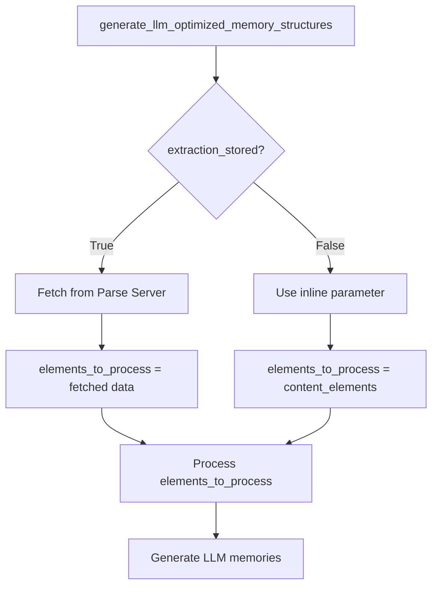

# Extraction Fetch Fix - Variable Shadowing Bug

## Problem
The `generate_llm_optimized_memory_structures` activity was receiving empty `structured_elements` even when `extraction_stored=True` and the data was successfully stored in Parse Server.

## Root Cause
**Variable shadowing bug** in the activity logic:

```python
async def generate_llm_optimized_memory_structures(
    content_elements: List[Dict[str, Any]],  # Function parameter
    ...
    extraction_stored: bool = False
):
    # When extraction_stored=True:
    if extraction_stored and post_id:
        extraction_data = await fetch_extraction_result_from_post(post_id)
        content_elements = extraction_data.get("structured_elements", [])  # Shadows parameter
    
    # Later in the code:
    for elem_dict in content_elements:  # BUG: Always used the parameter, not the fetched data!
        ...
```

### The Issue
1. When `extraction_stored=True`, the code would:
   - Fetch data from Parse Server ✅
   - Assign to `content_elements` (shadowing the parameter) ✅
   - But then continue using the **original parameter** which was empty `[]` ❌

2. When `extraction_stored=False`, the code would:
   - Use the inline `content_elements` parameter
   - Which was also empty `[]` because extraction was stored!

## The Fix

### Before (Broken)
```python
async def generate_llm_optimized_memory_structures(
    content_elements: List[Dict[str, Any]],  # Parameter: [] when stored
    ...
    extraction_stored: bool = False
):
    try:
        if extraction_stored and post_id:
            extraction_data = await fetch_extraction_result_from_post(post_id)
            content_elements = extraction_data.get("structured_elements", [])  # Shadows!
        
        # BUG: This uses the parameter, not the fetched data
        for elem_dict in content_elements:
            ...
```

### After (Fixed)
```python
async def generate_llm_optimized_memory_structures(
    content_elements: List[Dict[str, Any]],  # Parameter: [] when stored
    ...
    extraction_stored: bool = False
):
    try:
        # NEW: Use a separate variable to avoid shadowing
        elements_to_process = []
        
        if extraction_stored and post_id:
            # Large document: fetch from Parse
            extraction_data = await fetch_extraction_result_from_post(post_id)
            elements_to_process = extraction_data.get("structured_elements", [])
            logger.info(f"Fetched {len(elements_to_process)} elements from stored extraction")
        else:
            # Small document: use inline parameter
            elements_to_process = content_elements
            logger.info(f"Using {len(elements_to_process)} inline content elements")
        
        # FIXED: Now uses the correct source
        for elem_dict in elements_to_process:
            ...
```

## Key Changes

1. **Introduced `elements_to_process` variable** to explicitly track which source to use
2. **Added `else` branch** to handle the inline case explicitly
3. **Added logging** to show which path was taken and element count
4. **Updated all references** from `content_elements` to `elements_to_process`

## Flow Diagram



## Test Results

### Input (from workflow)
```python
[
  [],  # content_elements: empty when extraction_stored=True
  null,  # domain
  {...},  # base_metadata
  "Ky6jxP0yxI",  # organization_id
  "MwnkcNiGZU",  # namespace_id
  true,  # use_llm
  "updCsBc30o",  # post_id: where to fetch from
  true  # extraction_stored: flag to fetch
]
```

### Expected Behavior (After Fix)
1. Activity receives `extraction_stored=True` and `post_id="updCsBc30o"`
2. Logs: `"Fetching stored extraction result from Post updCsBc30o"`
3. Fetches from Parse Server successfully
4. Logs: `"Fetched 359 elements from stored extraction"`
5. Assigns to `elements_to_process` (not `content_elements`)
6. Processes all 359 elements ✅
7. Generates LLM-optimized memories ✅
8. Returns 359 memory requests ✅

## Related Fixes

This fix works in conjunction with:
1. **Batch size fix** (BATCH_SIZE_FIX_SUMMARY.md) - Handles 359 memories in chunks of 50
2. **Error handling** (EMPTY_EXTRACTION_DEBUG.md) - Clear error messages if fetch fails
3. **Parse Server storage** - Large extractions stored as compressed files

## Verification

To verify the fix works:

```bash
# Run the test
poetry run pytest tests/test_document_processing_v2.py::test_document_upload_v2_with_real_pdf_file -v -s

# Check logs for:
grep "Fetched .* elements from stored extraction" logs/app_2025-10-20.log
grep "Generating LLM-optimized memory structures for" logs/app_2025-10-20.log
```

Expected output:
```
Fetched 359 elements from stored extraction
Generating LLM-optimized memory structures for 359 elements in general domain
```

## Impact

This fix ensures that:
- ✅ Large documents (>500KB) are properly fetched from Parse Server
- ✅ All 359 elements are processed by the LLM
- ✅ Memory generation succeeds with full content
- ✅ No data loss due to variable shadowing
- ✅ Clear logging shows which path was taken

The workflow should now complete successfully! 🎉

