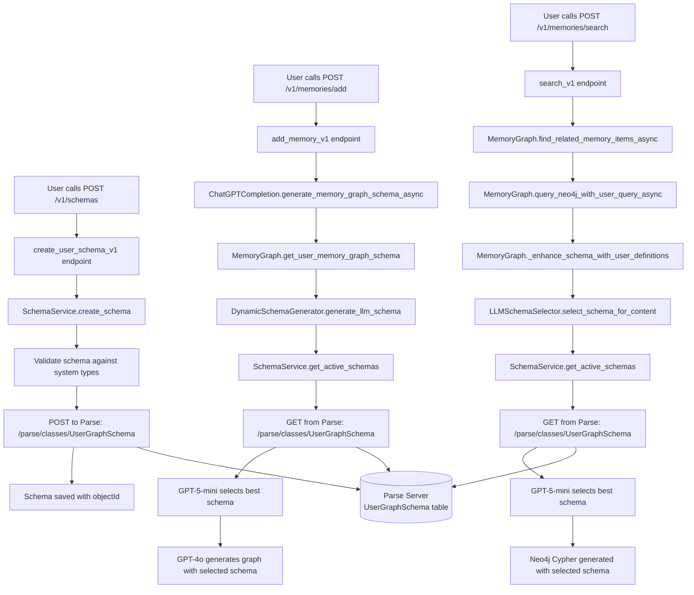

# 🔄 Schema Lifecycle: Save → Fetch → Use

## 📊 **Complete Flow Diagram**



## 🏗️ **1. SAVING Schemas to Parse**

### **When:** User creates a schema via API

**Endpoint:** `POST /v1/schemas`

**Flow:**
```python
# routers/v1/schema_routes_v1.py:147
@router.post("")
async def create_user_schema_v1(schema: UserGraphSchema, ...):
    # 1. Authenticate user
    user_id = get_user_from_token(...)
    
    # 2. Save to Parse via SchemaService
    result = await schema_service.create_schema(schema, user_id)
```

**Parse Save Location:**
```python
# services/schema_service.py:46-50
async with httpx.AsyncClient() as client:
    response = await client.post(
        f"{self.parse_server_url}/parse/classes/UserGraphSchema",  # ← SAVE HERE
        headers=self._get_headers(use_master_key=True),
        json=schema.model_dump()  # ← Full schema data
    )
    
    schema.id = result['objectId']  # ← Parse assigns ID
```

**Parse Table Structure:**
```json
{
  "className": "UserGraphSchema",
  "objectId": "abc123",
  "user_id": "user_xyz",
  "name": "E-commerce Schema",
  "description": "Schema for online retail",
  "status": "active",
  "node_types": {
    "Product": { "name": "Product", "properties": {...} },
    "Customer": { "name": "Customer", "properties": {...} }
  },
  "relationship_types": {
    "PURCHASED": { "name": "PURCHASED", "allowed_source_types": [...] }
  },
  "createdAt": "2024-01-17T17:30:45.123Z",
  "updatedAt": "2024-01-17T17:30:45.123Z"
}
```

## 📥 **2. FETCHING Schemas from Parse**

### **When:** During ADD and SEARCH operations

**Two main fetch points:**

#### **A. ADD Memory Operation**

**Trigger:** `POST /v1/memories/add`

**Fetch Location:**
```python
# api_handlers/chat_gpt_completion.py:3275
memory_graph_schema = await memory_graph.get_user_memory_graph_schema(
    user_id=user_id,
    content=content,
    operation_type="add_memory"  # ← ADD operation
)

# ↓ Calls DynamicSchemaGenerator
# services/dynamic_schema_generator.py:37
user_schemas = await self.schema_service.get_active_schemas(user_id, workspace_id)

# ↓ Calls SchemaService
# services/schema_service.py:226-231
async def get_active_schemas(self, user_id: str, workspace_id: Optional[str] = None):
    result = await self.list_schemas(user_id, workspace_id)  # ← FETCH HERE
    return [schema for schema in result.data if schema.status == SchemaStatus.ACTIVE]
```

#### **B. SEARCH Memory Operation**

**Trigger:** `POST /v1/memories/search`

**Fetch Location:**
```python
# memory/memory_graph.py:5555-5558
selector = LLMSchemaSelector(schema_service)
selected_schema_id, confidence = await selector.select_schema_for_content(
    content=query_content,
    operation_type="search_memory"  # ← SEARCH operation
)

# ↓ Inside LLMSchemaSelector
# services/llm_schema_selector.py:58
user_schemas = await self.schema_service.get_active_schemas(user_id, workspace_id)
```

**Parse Fetch Implementation:**
```python
# services/schema_service.py:134-143
async with httpx.AsyncClient() as client:
    response = await client.get(
        f"{self.parse_server_url}/parse/classes/UserGraphSchema",  # ← FETCH HERE
        headers=self._get_headers(),
        params={
            "where": json.dumps({
                "$or": [
                    {"user_id": user_id},           # User's own schemas
                    {"read_access": {"$in": [user_id]}},  # Shared schemas
                    {"scope": "workspace", "workspace_id": workspace_id},
                    {"scope": "organization"}
                ]
            }),
            "order": "-updatedAt",  # Most recent first
            "limit": 100
        }
    )
```

## 🎯 **3. USAGE in Operations**

### **ADD Operation Usage:**

```python
# 1. Fetch schemas from Parse
user_schemas = await get_active_schemas(user_id)

# 2. GPT-5-mini selects best schema
selected_schema = await gpt5_mini_select(content, user_schemas)

# 3. GPT-4o generates graph using selected schema
graph = await gpt4o_generate(content, selected_schema)

# 4. Store graph in Neo4j with schema validation
await store_graph(graph, selected_schema)
```

### **SEARCH Operation Usage:**

```python
# 1. Fetch schemas from Parse  
user_schemas = await get_active_schemas(user_id)

# 2. GPT-5-mini selects best schema for query
selected_schema = await gpt5_mini_select(query, user_schemas)

# 3. Enhance Neo4j schema discovery with user schema
enhanced_schema = merge(discovered_schema, selected_schema)

# 4. Generate Cypher query using enhanced schema
cypher = await generate_cypher(query, enhanced_schema)
```

## 📍 **Key Integration Points**

| Operation | Parse Fetch Point | Usage Point | GPT-5-mini Selection |
|-----------|------------------|-------------|---------------------|
| **CREATE Schema** | ❌ No fetch | `POST /parse/classes/UserGraphSchema` | ❌ No selection |
| **ADD Memory** | `get_active_schemas()` | `generate_llm_schema()` | ✅ Content-based |
| **SEARCH Memory** | `get_active_schemas()` | `_enhance_schema_with_user_definitions()` | ✅ Query-based |

## 🔄 **Complete Request Lifecycle**

### **Schema Creation:**
```bash
POST /v1/schemas {
  "name": "E-commerce Schema",
  "node_types": {...},
  "relationship_types": {...}
}

# → Saves to Parse Server immediately
# → Available for future ADD/SEARCH operations
```

### **Memory Addition:**
```bash
POST /v1/memories/add {
  "content": "Customer bought iPhone for $999"
}

# 1. Fetch user schemas from Parse
# 2. GPT-5-mini: "E-commerce Schema best fits this content"
# 3. GPT-4o: Generate graph using E-commerce Schema
# 4. Store in Neo4j with schema validation
```

### **Memory Search:**
```bash
POST /v1/memories/search {
  "query": "find customer purchases over $900"
}

# 1. Fetch user schemas from Parse
# 2. GPT-5-mini: "E-commerce Schema best fits this query"  
# 3. Enhance Neo4j schema with E-commerce types
# 4. Generate Cypher using enhanced schema
# 5. Return matching results
```

## 🎉 **Summary**

- **SAVE**: Schemas saved to Parse Server when user calls `POST /v1/schemas`
- **FETCH**: Schemas fetched from Parse during BOTH `add_memory` and `search_memory` operations
- **USE**: GPT-5-mini intelligently selects the best schema for each operation
- **CONSISTENCY**: Same schema selection logic ensures ADD and SEARCH use compatible schemas

The lifecycle is **complete and production-ready**! 🚀


