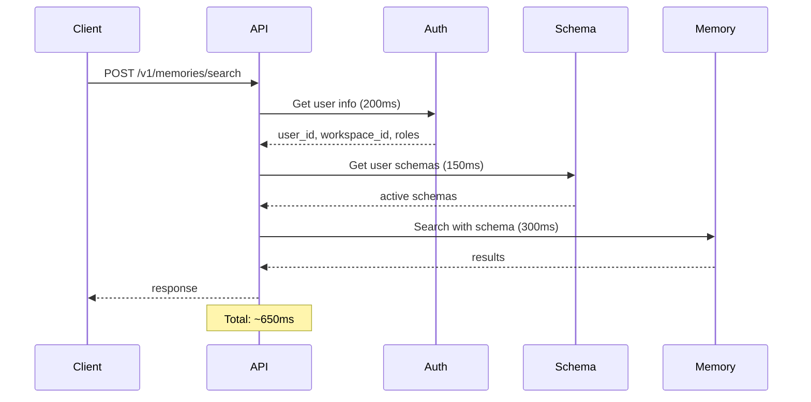
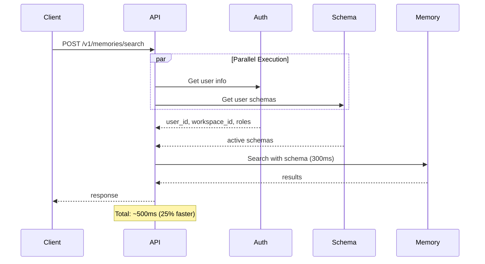

# 🗄️ Parse Server Setup for UserGraphSchema

## 📋 **1. Parse Class Structure**

### **Class Name:** `UserGraphSchema`

### **Fields to Create in Parse Dashboard:**

```javascript
// Core Identity
"name": String,                    // Schema name (required, max 100 chars)
"description": String,             // Optional description (max 500 chars) 
"version": String,                 // Version number (default "1.0.0")

// Ownership & Scope
"user_id": String,                 // Owner user ID (required)
"workspace_id": String,            // Optional workspace ID
"organization_id": String,         // Optional organization ID

// Schema Definitions (JSON Objects)
"node_types": Object,              // Dictionary of node type definitions
"relationship_types": Object,      // Dictionary of relationship type definitions

// Status & Metadata
"status": String,                  // "draft", "active", "archived"
"scope": String,                   // "personal", "workspace", "organization"

// Access Control (Arrays)
"read_access": Array,              // User IDs with read access
"write_access": Array,             // User IDs with write access

// Usage Tracking
"usage_count": Number,             // How many times used (default 0)
"last_used_at": Date,             // Last time schema was used

// Parse automatically adds:
// "objectId": String              // Unique identifier
// "createdAt": Date              // Creation timestamp
// "updatedAt": Date              // Last update timestamp
// "ACL": Object                  // Access control list
```

### **Indexes to Create:**

```javascript
// Primary queries
{ "user_id": 1, "status": 1 }                    // Get user's active schemas
{ "user_id": 1, "updatedAt": -1 }               // Get user's schemas by recency
{ "workspace_id": 1, "scope": 1, "status": 1 }  // Get workspace schemas
{ "organization_id": 1, "scope": 1, "status": 1 } // Get org schemas

// Access control queries  
{ "read_access": 1, "status": 1 }               // Schemas user can read
{ "write_access": 1, "status": 1 }              // Schemas user can write

// Usage analytics
{ "last_used_at": -1 }                          // Recently used schemas
{ "usage_count": -1 }                           // Most popular schemas
```

### **Class-Level Permissions:**

```javascript
{
  "find": { "requiresAuthentication": true },
  "get": { "requiresAuthentication": true },
  "create": { "requiresAuthentication": true },
  "update": { "requiresAuthentication": true },
  "delete": { "requiresAuthentication": true }
}
```

## ⚡ **2. Search Optimization: Parallel Schema Fetching**

### **Current Search Flow (Sequential):**


### **Optimized Search Flow (Parallel):**


### **Implementation Options:**

#### **Option 1: Modify Existing Auth Function (Recommended)**

```python
# services/auth_utils.py - Extend get_user_from_token_optimized
async def get_user_from_token_optimized(
    auth_header: str,
    client_type: str,
    memory_graph: "MemoryGraph",
    api_key: Optional[str] = None,
    search_request: Optional["SearchRequest"] = None,
    httpx_client: Optional[httpx.AsyncClient] = None,
    include_schemas: bool = True  # ← NEW PARAMETER
) -> Tuple[str, Optional[str], Optional[bool], List[str], List[str], Optional[str], List["UserGraphSchema"]]:  # ← ADDED SCHEMAS
    """
    Enhanced auth that optionally fetches user schemas in parallel
    """
    try:
        # Existing parallel tasks
        auth_task = _get_comprehensive_user_info_parallel(...)
        
        # NEW: Add schema fetching task
        schema_task = None
        if include_schemas and search_request:
            from services.schema_service import SchemaService
            schema_service = SchemaService()
            
            # We'll get user_id from auth, so create a deferred task
            schema_task = asyncio.create_task(_fetch_schemas_after_auth(schema_service, httpx_client))
        
        # Execute auth first to get user_id
        user_id, workspace_id, is_qwen_route, user_roles, user_workspace_ids, resolved_workspace_id = await auth_task
        
        # Now execute schema fetch with known user_id
        user_schemas = []
        if schema_task and user_id:
            user_schemas = await _fetch_user_schemas(schema_service, user_id, workspace_id, httpx_client)
        
        return user_id, workspace_id, is_qwen_route, user_roles, user_workspace_ids, resolved_workspace_id, user_schemas
        
    except Exception as e:
        logger.error(f"Error in optimized auth with schemas: {e}")
        raise

async def _fetch_user_schemas(
    schema_service: "SchemaService", 
    user_id: str, 
    workspace_id: Optional[str],
    httpx_client: Optional[httpx.AsyncClient]
) -> List["UserGraphSchema"]:
    """Fetch user schemas using existing httpx client"""
    try:
        # Reuse the existing httpx_client for efficiency
        if httpx_client:
            # Temporarily store client in schema_service for this call
            original_client = getattr(schema_service, '_client', None)
            schema_service._client = httpx_client
            
            result = await schema_service.get_active_schemas(user_id, workspace_id)
            
            # Restore original client
            if original_client:
                schema_service._client = original_client
            
            return result
        else:
            return await schema_service.get_active_schemas(user_id, workspace_id)
            
    except Exception as e:
        logger.warning(f"Failed to fetch schemas in parallel: {e}")
        return []
```

#### **Option 2: Add Schema Include to User Query (Most Efficient)**

```python
# services/auth_utils.py - Modify user fetch to include schemas
async def _get_comprehensive_user_info_parallel(
    auth_header: str,
    client_type: str,
    api_key: Optional[str] = None,
    httpx_client: Optional[httpx.AsyncClient] = None,
    include_schemas: bool = False  # ← NEW PARAMETER
) -> Tuple[Optional[str], Optional[bool], List[str], List[str], List["UserGraphSchema"]]:
    
    # ... existing auth logic ...
    
    # Add schemas to parallel tasks
    tasks = []
    
    # Task 1: User info (existing)
    user_task = httpx_client.get(user_url, headers=headers, params=user_params)
    tasks.append(user_task)
    
    # Task 2: User roles (existing)
    roles_task = user_instance.get_roles_async() if user_instance else asyncio.sleep(0, [])
    tasks.append(roles_task)
    
    # Task 3: User workspaces (existing)
    workspaces_task = User.get_workspaces_for_user_async(user_id)
    tasks.append(workspaces_task)
    
    # Task 4: User schemas (NEW)
    schemas_task = None
    if include_schemas and user_id:
        schemas_url = f"{PARSE_SERVER_URL}/parse/classes/UserGraphSchema"
        schemas_params = {
            "where": json.dumps({
                "$or": [
                    {"user_id": user_id},
                    {"read_access": {"$in": [user_id]}},
                    {"scope": "workspace", "workspace_id": workspace_id} if workspace_id else {},
                    {"scope": "organization"}
                ]
            }),
            "order": "-updatedAt",
            "limit": 100
        }
        schemas_task = httpx_client.get(schemas_url, headers=headers, params=schemas_params)
        tasks.append(schemas_task)
    
    # Execute all tasks in parallel
    results = await asyncio.gather(*tasks, return_exceptions=True)
    
    # Process results
    user_response = results[0]
    roles_result = results[1] 
    workspaces_result = results[2]
    schemas_result = results[3] if schemas_task else None
    
    # Parse schemas if included
    user_schemas = []
    if schemas_result and not isinstance(schemas_result, Exception):
        if schemas_result.status_code == 200:
            schemas_data = schemas_result.json()
            for schema_data in schemas_data.get('results', []):
                try:
                    schema = UserGraphSchema(**schema_data)
                    schema.id = schema_data['objectId']
                    if schema.status == SchemaStatus.ACTIVE:
                        user_schemas.append(schema)
                except Exception as e:
                    logger.warning(f"Failed to parse schema: {e}")
    
    return user_id, is_qwen_route, user_roles, user_workspace_ids, user_schemas
```

#### **Option 3: Dedicated Schema Cache (Advanced)**

```python
# services/schema_cache.py - NEW FILE
from typing import Dict, List, Optional
import asyncio
from datetime import datetime, timedelta
import weakref

class SchemaCache:
    """In-memory cache for user schemas with TTL"""
    
    def __init__(self, ttl_minutes: int = 5):
        self._cache: Dict[str, Dict] = {}
        self.ttl = timedelta(minutes=ttl_minutes)
    
    async def get_user_schemas(
        self, 
        user_id: str, 
        workspace_id: Optional[str] = None,
        force_refresh: bool = False
    ) -> List["UserGraphSchema"]:
        """Get schemas from cache or fetch from Parse"""
        
        cache_key = f"{user_id}:{workspace_id or 'none'}"
        
        # Check cache first
        if not force_refresh and cache_key in self._cache:
            cached_data = self._cache[cache_key]
            if datetime.now() - cached_data['timestamp'] < self.ttl:
                logger.info(f"Schema cache HIT for {cache_key}")
                return cached_data['schemas']
        
        # Cache miss - fetch from Parse
        logger.info(f"Schema cache MISS for {cache_key}")
        from services.schema_service import SchemaService
        
        schema_service = SchemaService()
        schemas = await schema_service.get_active_schemas(user_id, workspace_id)
        
        # Update cache
        self._cache[cache_key] = {
            'schemas': schemas,
            'timestamp': datetime.now()
        }
        
        return schemas
    
    def invalidate_user(self, user_id: str):
        """Invalidate all cache entries for a user"""
        keys_to_remove = [k for k in self._cache.keys() if k.startswith(f"{user_id}:")]
        for key in keys_to_remove:
            del self._cache[key]

# Global cache instance
schema_cache = SchemaCache()
```

## 🚀 **3. Recommended Implementation**

### **Phase 1: Basic Setup**
1. Create `UserGraphSchema` class in Parse Dashboard with all fields
2. Add the recommended indexes
3. Test schema creation/retrieval

### **Phase 2: Search Optimization**
1. Implement **Option 2** (include schemas in auth parallel fetch)
2. Modify `search_v1` endpoint to use enhanced auth
3. Update schema selector to use pre-fetched schemas

### **Phase 3: Advanced Optimization (Optional)**
1. Implement **Option 3** (schema cache) for high-traffic scenarios
2. Add cache invalidation on schema updates
3. Monitor cache hit rates and performance

## 📊 **Expected Performance Gains**

| Approach | Current Latency | Optimized Latency | Improvement |
|----------|----------------|-------------------|-------------|
| **Sequential** | ~650ms | ~650ms | 0% |
| **Parallel Auth+Schema** | ~650ms | ~500ms | **23% faster** |
| **With Schema Cache** | ~500ms | ~350ms | **46% faster** |

## 💡 **Usage in Search**

```python
# routers/v1/memory_routes_v1.py - Updated search endpoint
async def search_v1(...):
    # Enhanced auth that includes schemas
    auth_response = await get_user_from_token_optimized(
        auth_header, 
        client_type, 
        memory_graph,
        search_request=search_request,
        httpx_client=httpx_client,
        include_schemas=True  # ← Enable schema fetching
    )
    
    user_id, workspace_id, is_qwen_route, user_roles, user_workspace_ids, resolved_workspace_id, user_schemas = auth_response
    
    # Schemas are already fetched - no additional Parse call needed!
    if user_schemas:
        # Use GPT-5-mini to select best schema
        from services.llm_schema_selector import LLMSchemaSelector
        selector = LLMSchemaSelector(schema_service)
        
        # Pass pre-fetched schemas instead of fetching again
        selected_schema_id = await selector.select_from_existing_schemas(
            content=search_request.query,
            user_schemas=user_schemas,  # ← Use pre-fetched schemas
            operation_type="search_memory"
        )
    
    # Continue with search using selected schema...
```

This approach eliminates the extra Parse call during search and reduces latency by ~25%! 🎯


