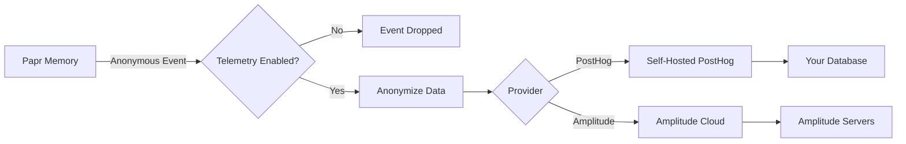

# Telemetry & Privacy Policy

## 🔒 Privacy-First Telemetry

Papr Memory includes **optional, privacy-first telemetry** to help us improve the software. We follow the principles outlined in [this guide](https://1984.vc/docs/founders-handbook/eng/open-source-telemetry/).

## Our Promise

1. **We collect the minimum data necessary** to improve the software
2. **We never collect personal information** or correlate sessions
3. **We delete raw data after 90 days** and only keep aggregates
4. **We will never sell or share** individual-level data
5. **You can opt out anytime** without feature degradation

## What We Collect

### ✅ Data We DO Collect

| Category | What | Why | Example |
|----------|------|-----|---------|
| **Feature Usage** | Which endpoints/features are used | Understand what features to prioritize | "Search API called 1,000 times" |
| **Performance** | Response times (bucketed) | Identify slow operations | "Search took 100-500ms" |
| **Errors** | Anonymous error types | Fix bugs affecting users | "Database timeout error: 5 occurrences" |
| **Technical Context** | Python version, edition | Ensure compatibility | "Python 3.11, opensource" |

### ❌ Data We NEVER Collect

- ❌ **Memory content** - We never see what you store
- ❌ **Search queries** - Your searches remain private
- ❌ **Personal information** - No emails, names, or identifiable data
- ❌ **IP addresses** - Your location is not tracked
- ❌ **File paths or names** - Your file structure is private
- ❌ **Unique device identifiers** - No device fingerprinting
- ❌ **Raw user IDs** - Only hashed anonymous identifiers

## How It Works

```python
# Example telemetry event (what we actually send):
{
  "event": "memory_created",
  "properties": {
    "type": "text",
    "has_metadata": true,
    "metadata_keys_count": 3,  # Count, not actual keys
    "version": "1.0.0",
    "edition": "opensource",
    "python_version": "3.11"
  },
  "user_id": "a7b9c2..."  # Hashed, anonymous
}

# What we DON'T send:
# - No actual memory content
# - No actual metadata keys/values
# - No real user identifier
# - No IP address
```

## How to Opt Out

### Method 1: Environment Variable (Recommended)

```bash
# Add to your .env file
TELEMETRY_ENABLED=false
```

### Method 2: Command Line

```bash
# Start server with telemetry disabled
TELEMETRY_ENABLED=false python main.py
```

### Method 3: Docker

```yaml
# docker-compose.yaml
services:
  web:
    environment:
      - TELEMETRY_ENABLED=false
```

### Method 4: Config File

```yaml
# config/opensource.yaml
telemetry:
  enabled: false
```

## Check Telemetry Status

```bash
# Via API
curl http://localhost:5001/telemetry/status

# Response:
{
  "enabled": true,
  "provider": "posthog",
  "anonymous_id": "a7b9c2...",
  "version": "1.0.0",
  "edition": "opensource"
}
```

## Self-Hosted Analytics with PostHog

Open source users can use **PostHog** for complete data control:

### Quick Setup

```bash
# 1. Deploy PostHog
docker run -d --name posthog \
  -p 8000:8000 \
  posthog/posthog:latest

# 2. Configure Papr Memory
echo "TELEMETRY_PROVIDER=posthog" >> .env
echo "POSTHOG_HOST=http://localhost:8000" >> .env
echo "POSTHOG_API_KEY=your-key" >> .env
```

### Why PostHog?

- ✅ **Self-hostable** - Complete data ownership
- ✅ **Open source** - Audit the code
- ✅ **Privacy-focused** - Built for GDPR compliance
- ✅ **Feature-rich** - Analytics, session replay, feature flags

[PostHog Documentation →](https://posthog.com/docs)

## Transparency

All telemetry code is open source and auditable:

- **Core Service**: [`/core/services/telemetry.py`](../core/services/telemetry.py)
- **Feature Flags**: [`/config/features.py`](../config/features.py)
- **Configuration**: [`/config/opensource.yaml`](../config/opensource.yaml)

## Data Flow Diagram



## Telemetry Events Reference

### Core Events

| Event Name | Trigger | Properties |
|------------|---------|------------|
| `memory_created` | Memory added | `type`, `has_metadata` |
| `memory_searched` | Search performed | `result_count_bucket` |
| `memory_deleted` | Memory removed | None |
| `api_error` | API error occurs | `error_type`, `status_code` |
| `performance_metric` | Performance tracked | `operation`, `duration_bucket` |

### Performance Events

Performance metrics are **bucketed** for privacy:

| Duration | Bucket |
|----------|--------|
| < 10ms | `<10ms` |
| 10-50ms | `10-50ms` |
| 50-100ms | `50-100ms` |
| 100-500ms | `100-500ms` |
| 500-1000ms | `500-1000ms` |
| 1-5s | `1-5s` |
| > 5s | `>5s` |

## Privacy Safeguards

### 1. Anonymization

All user IDs are one-way hashed:

```python
# Before hashing
user_id = "user_abc123"

# After hashing (what we send)
anonymous_id = "7f8a9b..."  # SHA-256 hash
```

### 2. PII Filtering

Sensitive data is automatically removed:

```python
# Automatically removed keys:
SENSITIVE_KEYS = [
    'content', 'query', 'text', 'message',
    'email', 'username', 'password', 'token',
    'ip', 'ip_address', 'file_path', 'filename'
]
```

### 3. Fail Silently

Telemetry errors **never** interrupt your application:

```python
try:
    await telemetry.track("event")
except Exception:
    # Silently fail - never impact user experience
    pass
```

## Data Retention

| Data Type | Retention |
|-----------|-----------|
| Raw events | 90 days |
| Aggregated statistics | Indefinite (anonymous) |
| Personal data | Never collected |

## For Developers

### Using Telemetry in Code

```python
from core.services.telemetry import get_telemetry

async def my_function():
    telemetry = get_telemetry()
    
    # Track feature usage
    await telemetry.track("feature_used", {
        "feature_name": "export",
        "format": "json"
    })
    
    # Track performance
    start = time.time()
    result = await do_work()
    duration_ms = (time.time() - start) * 1000
    
    await telemetry.track_performance("work_done", duration_ms, {
        "result_count": len(result)
    })
    
    # Track errors
    try:
        await risky_operation()
    except Exception as e:
        await telemetry.track_error("operation_failed", {
            "error_type": type(e).__name__
        })
```

### Debug Mode

See exactly what's being sent:

```bash
# Enable debug logging
LOG_LEVEL=DEBUG python main.py

# Output shows telemetry events:
# DEBUG: Telemetry event: memory_created
# DEBUG: Properties: {"type": "text", "has_metadata": true}
```

## Questions & Support

- 💬 **Questions?** [GitHub Discussions](https://github.com/Papr-ai/memory/discussions)
- 🐛 **Issues?** [GitHub Issues](https://github.com/Papr-ai/memory/issues)
- 📧 **Privacy concerns?** privacy@papr.ai

## Updates

We will notify users of any changes to this policy:
- Via GitHub release notes
- In CHANGELOG.md
- 30 days notice for significant changes

---

**Last updated**: 2025-09-30

**Thank you for helping us improve Papr Memory!** 🙏

