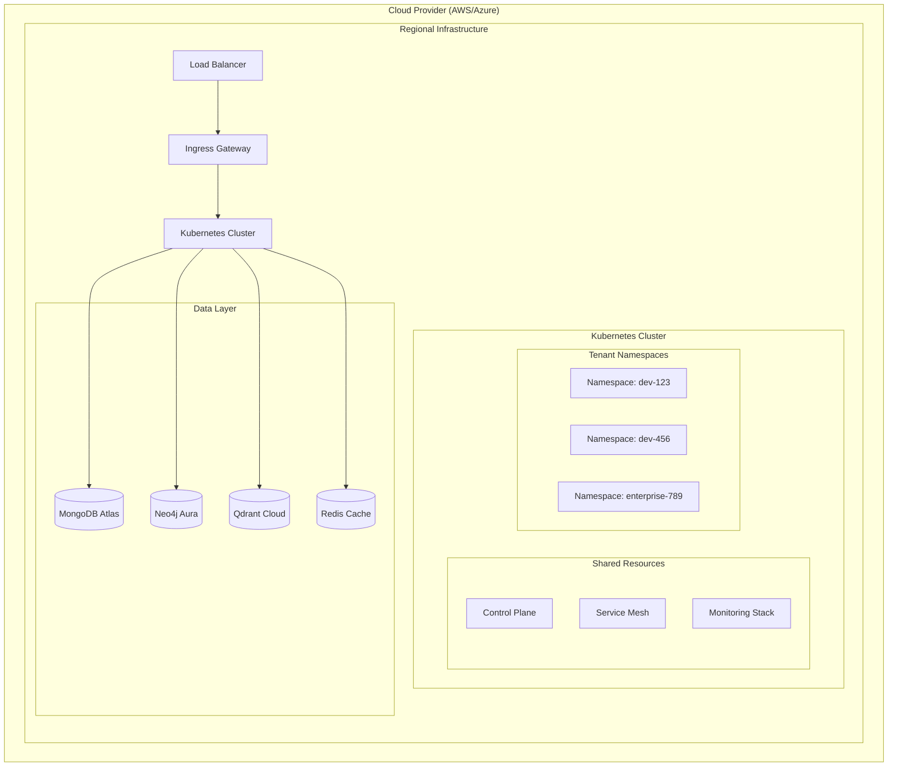

# Namespace Deployment Architecture for Developer Cloud Regions

## Overview

This document outlines the technical architecture and business strategy for deploying isolated developer namespaces across cloud regions for PAPR Memory. It addresses multi-tenant infrastructure, cost modeling, and scaling strategies.

## Table of Contents

- [Infrastructure Architecture](#infrastructure-architecture)
- [Isolation Models & Cost Analysis](#isolation-models--cost-analysis)
- [Pricing Strategy](#pricing-strategy)
- [Implementation Roadmap](#implementation-roadmap)
- [Regional Deployment](#regional-deployment)
- [Operations & Monitoring](#operations--monitoring)

## Infrastructure Architecture

### Core Technology Stack



### Tenant Isolation Strategy

| Component | Shared Model | Dedicated Nodes | Dedicated Cluster |
|-----------|--------------|-----------------|-------------------|
| **Control Plane** | Shared | Shared | Dedicated |
| **Worker Nodes** | Shared | Dedicated Pool | Dedicated |
| **Storage** | Namespace-scoped | Dedicated volumes | Dedicated |
| **Network** | Network Policies | Node-level isolation | Complete isolation |
| **Database** | Schema isolation | Database isolation | Instance isolation |
| **Cost** | Lowest | Medium | Highest |
| **Isolation** | Good | Better | Maximum |

## Isolation Models & Cost Analysis

### 1. Shared Cluster Model (Starter/Professional Tiers)

**Architecture:**
- Single Kubernetes cluster per region
- Namespace-based tenant isolation
- Shared node pools with resource quotas
- Network policies for traffic isolation

**Cost Structure:**
- **Base Infrastructure**: $800-2,500/month per region
- **Per Namespace**: $25-150/month
- **Scaling Factor**: Linear with namespace count

**Suitable For:**
- Startup developers
- Development/testing environments
- Cost-sensitive customers
- Non-compliance workloads

### 2. Dedicated Node Groups (Business Tier)

**Architecture:**
- Dedicated worker node pools per customer tier
- Enhanced security with node-level isolation
- Dedicated ingress controllers
- Isolated monitoring stacks

**Cost Structure:**
- **Base Infrastructure**: $2,000-6,000/month per region
- **Per Customer**: $300-1,200/month
- **Scaling Factor**: Stepped scaling with node group sizes

**Suitable For:**
- Business customers
- Production workloads
- Performance-sensitive applications
- Medium compliance requirements

### 3. Dedicated Clusters (Enterprise Tier)

**Architecture:**
- Complete cluster isolation per customer
- Dedicated control plane and workers
- Custom networking and security policies
- Dedicated monitoring and logging

**Cost Structure:**
- **Per Customer**: $5,000-20,000/month
- **Management Overhead**: $2,000-5,000/month
- **Scaling Factor**: Per-customer cluster costs

**Suitable For:**
- Enterprise customers
- Regulatory compliance requirements
- High-security workloads
- Custom networking needs

## Pricing Strategy

### PAPR Current Pricing Structure

#### Developer Tier - Free
```yaml
Resources:
  Memory Operations: 1,000/month
  Storage: 1GB
  Active Memories: 2,500
  End Users: Unlimited

Features:
  - Vector + Agentic Graph Memory
  - Community Support

Isolation:
  Model: Shared cluster only
  Namespace: Standard isolation
```

#### Starter Tier - $100/month
```yaml
Resources:
  Memory Operations: 50,000/month
  Storage: 10GB
  Active Memories: 100,000
  End Users: Unlimited

Features:
  - Vector + Agentic Graph Memory
  - Community Support

Isolation:
  Model: Shared cluster + optional dedicated
  Namespace: Standard isolation + dedicated add-on
  Dedicated Rate: +$3.00/hour for dedicated pods
```

#### Growth Tier - $500/month
```yaml
Resources:
  Memory Operations: 750,000/month
  Storage: 100GB
  Active Memories: 1,000,000
  End Users: Unlimited

Features:
  - Vector + Agentic Graph Memory
  - Private Slack Channel
  - Advanced Analytics
  - Multiple projects support

Isolation:
  Model: Shared cluster + optional dedicated
  Namespace: Enhanced isolation + dedicated add-on
  Dedicated Rate: +$12.00/hour for dedicated node pools
```

#### Enterprise Tier - Flexible Pricing
```yaml
Resources:
  Memory Operations: Unlimited
  Storage: Unlimited
  Active Memories: Unlimited
  End Users: Unlimited
  API Calls: Unlimited

Features:
  - Vector + Agentic Graph Memory
  - Private Slack Channel
  - Advanced Analytics
  - On-premise deployment
  - SSO
  - Audit Logs
  - Custom Integrations
  - SLA

Isolation:
  Model: Dedicated clusters available
  Namespace: Complete isolation options
  Dedicated Rate: Custom pricing ($50-200/hour)
```

### Usage-Based Pricing Components

#### Memory Operations Pricing
```yaml
Base Allocation:
  Starter: 10,000 operations/month
  Professional: 100,000 operations/month
  Business: 500,000 operations/month
  Enterprise: Unlimited

Overage Pricing:
  - $0.002 per operation above base
  - Volume discounts at 1M+ operations
  - Enterprise custom pricing
```

#### Storage Pricing
```yaml
Base Allocation:
  Starter: 10GB included
  Professional: 50GB included
  Business: 200GB included
  Enterprise: 500GB included

Overage Pricing:
  - $0.15 per GB/month above base
  - High-performance storage: +50% premium
```

#### Regional Deployment Pricing
```yaml
Additional Regions:
  Starter: Not available
  Professional: +$99/month per region
  Business: +$199/month per region
  Enterprise: Custom pricing
```

## Implementation Roadmap

### Phase 1: Foundation (Months 1-2)
- [ ] Single region shared cluster deployment
- [ ] Basic namespace isolation
- [ ] Standard monitoring and logging
- [ ] Starter and Professional tier support

### Phase 2: Enhanced Isolation (Month 3)
- [ ] Dedicated node groups for Business tier
- [ ] Advanced monitoring with tenant segmentation
- [ ] Enhanced security policies
- [ ] SLA monitoring and alerting

### Phase 3: Multi-Region (Months 4-5)
- [ ] Second region deployment
- [ ] Cross-region networking
- [ ] Data residency controls
- [ ] Regional failover capabilities

### Phase 4: Enterprise Features (Month 6)
- [ ] Dedicated cluster option
- [ ] Compliance certifications (SOC2, ISO27001)
- [ ] Custom networking configurations
- [ ] Private deployment options

### Phase 5: Scale & Optimize (Months 7-12)
- [ ] Auto-scaling optimization
- [ ] Cost optimization initiatives
- [ ] Performance tuning
- [ ] Additional regional expansion

## Regional Deployment

### AWS Implementation

```yaml
us-east-1:
  primary: true
  services:
    - EKS cluster (production)
    - RDS Multi-AZ
    - ElastiCache cluster
    - S3 regional buckets

us-west-2:
  primary: false
  services:
    - EKS cluster (DR/scaling)
    - RDS read replicas
    - Cross-region replication

eu-west-1:
  primary: false
  services:
    - GDPR compliance region
    - Data residency controls
```

### Azure Implementation

```yaml
East US:
  primary: true
  services:
    - AKS cluster
    - Azure Database
    - Redis Cache
    - Storage accounts

West Europe:
  primary: false
  services:
    - GDPR compliance region
    - Disaster recovery
```

### Data Residency Strategy

```yaml
Compliance Zones:
  US: us-east-1, us-west-2
  EU: eu-west-1, eu-central-1
  APAC: ap-southeast-1, ap-northeast-1

Data Classification:
  - Memory content: Regional residency required
  - Metadata: Can cross regions (encrypted)
  - Analytics: Aggregated, anonymized
  - Logs: Regional retention
```

## Operations & Monitoring

### Monitoring Stack

```yaml
Metrics:
  - Prometheus (per cluster)
  - Grafana (centralized dashboards)
  - Custom metrics per tenant

Logging:
  - Fluentd/Fluent Bit
  - Elasticsearch cluster
  - Tenant-scoped log access

Alerting:
  - AlertManager
  - PagerDuty integration
  - Tenant-specific alerts

Cost Tracking:
  - Kubecost for resource attribution
  - Cloud provider cost APIs
  - Tenant billing integration
```

### Security Operations

```yaml
Image Security:
  - Container image scanning
  - Vulnerability database updates
  - Security policy enforcement

Runtime Security:
  - Falco for anomaly detection
  - Network traffic analysis
  - Pod security monitoring

Compliance:
  - Regular security audits
  - Compliance reporting
  - Certification maintenance
```

### Disaster Recovery

```yaml
Backup Strategy:
  - Velero for cluster backups
  - Database backups (automated)
  - Cross-region backup replication

Recovery Objectives:
  - RTO: 4 hours
  - RPO: 1 hour
  - Automated failover for critical tiers
```

## Cost Estimation Model

### Customer Acquisition Scenarios

#### Small Developer (Starter Tier)
```yaml
Monthly Cost to PAPR:
  Infrastructure: $15/month (shared costs)
  Operations: $10/month
  Support: $5/month
  Total: $30/month

Customer Pays: $49/month
Gross Margin: 39% ($19/month)
```

#### Growing Business (Business Tier)
```yaml
Monthly Cost to PAPR:
  Infrastructure: $200/month (dedicated nodes)
  Operations: $50/month
  Support: $75/month
  Total: $325/month

Customer Pays: $499/month
Gross Margin: 35% ($174/month)
```

#### Enterprise Customer (Enterprise Tier)
```yaml
Monthly Cost to PAPR:
  Infrastructure: $800/month (dedicated cluster)
  Operations: $200/month
  Support: $300/month
  Total: $1,300/month

Customer Pays: $1,999/month
Gross Margin: 35% ($699/month)
```

### Break-Even Analysis

```yaml
Fixed Costs per Region:
  Base Infrastructure: $2,000/month
  Operations Team: $15,000/month
  Tools & Licenses: $2,000/month
  Total: $19,000/month

Break-Even Points:
  Starter Tier: 1,000 customers
  Professional Tier: 200 customers
  Business Tier: 60 customers
  Enterprise Tier: 20 customers
```

## Recommendations

### Isolation Strategy
1. **Start with Shared Clusters**: Implement namespace isolation for initial market entry
2. **Add Dedicated Nodes**: Introduce Business tier with enhanced isolation
3. **Scale to Dedicated Clusters**: Enterprise tier for compliance and high-security needs
4. **Hybrid Approach**: Maintain multiple isolation levels for different customer segments

### Pricing Strategy
1. **Value-Based Pricing**: Price based on customer value, not just costs
2. **Clear Upgrade Path**: Easy migration between tiers
3. **Usage-Based Components**: Align pricing with customer growth
4. **Regional Pricing**: Consider local market conditions

### Implementation Priority
1. **Phase 1**: Shared cluster with strong isolation (Months 1-2)
2. **Phase 2**: Multi-tier isolation models (Month 3)
3. **Phase 3**: Multi-region deployment (Months 4-5)
4. **Phase 4**: Enterprise features and compliance (Month 6)

This architecture provides a scalable path from startup to enterprise customers while maintaining cost efficiency and technical flexibility.