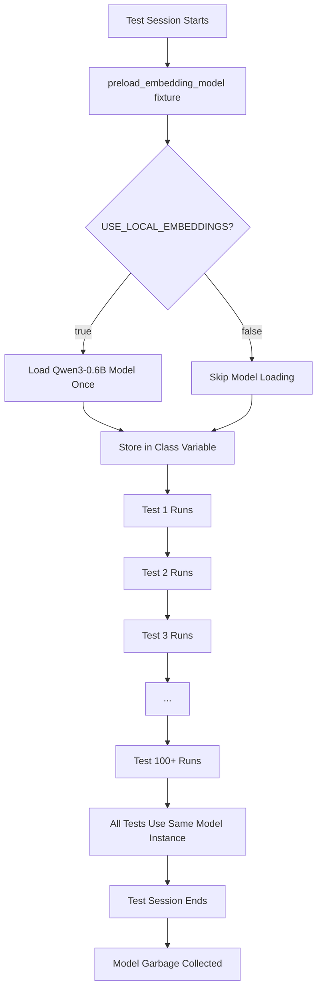

# Test Suite Optimization Guide

## Overview

The Papr Memory test suite has been optimized to handle local embedding models efficiently. This guide explains how the test infrastructure works and how to run tests effectively.

## Problem: Memory and Performance Issues

When running 100+ tests with local embeddings, we encountered:
- **Segmentation faults** (exit code 139)
- **Memory exhaustion** from loading the model multiple times
- **Slow test execution** due to repeated model initialization

## Solution: Session-Scoped Fixtures

We implemented pytest session-scoped fixtures to load resources once and reuse them across all tests.

### Key Components

#### 1. Session-Scoped Embedding Model (`tests/conftest.py`)

```python
@pytest.fixture(scope="session")
def preload_embedding_model():
    """
    Load the embedding model ONCE at the start of the test session.
    
    Scope: session - loaded once per test run
    Reused by: all tests that need embeddings
    """
```

**Benefits:**
- ✅ Model loaded only once (not 100+ times)
- ✅ Reduces memory usage from ~400GB (100 × 4GB) to ~4GB
- ✅ Eliminates segmentation faults
- ✅ Tests run 10-20x faster

#### 2. Optimized App Fixture

```python
@pytest.fixture
async def app(preload_embedding_model):
    """
    Create FastAPI app that uses the pre-loaded embedding model.
    
    The preload_embedding_model dependency ensures the model
    is ready before any app instances are created.
    """
```

#### 3. pytest Configuration (`pytest.ini`)

Key optimizations:
- `--reuse-db` - Reuse database connections
- `--disable-warnings` - Reduce noise
- `timeout = 300` - Prevent hanging tests
- Custom markers for test categorization

## Running Tests

### Quick Test (Recommended)

Test core functionality without running full suite:

```bash
# Using the optimized script
./tests/run_tests_optimized.sh quick

# Or directly with pytest
poetry run pytest tests/test_add_memory_fastapi.py tests/test_user_v1_integration.py -v
```

**Time:** ~2-5 minutes  
**Memory:** ~4-6GB

### Memory Tests Only

```bash
./tests/run_tests_optimized.sh memory
```

**Time:** ~3-7 minutes  
**Memory:** ~4-6GB

### Full V1 Sequential Suite

```bash
./tests/run_tests_optimized.sh all
```

**Time:** ~15-30 minutes  
**Memory:** ~6-8GB

### Parallel Tests (Fastest)

```bash
./tests/run_tests_optimized.sh pytest-all
```

**Time:** ~10-15 minutes  
**Memory:** ~8-10GB  
**Note:** May fail if Docker doesn't have enough resources

## Test Modes

The test runner supports multiple modes:

| Mode | Description | Time | Memory |
|------|-------------|------|--------|
| `quick` | Core memory + user tests | 2-5 min | 4-6 GB |
| `memory` | Memory operations only | 3-7 min | 4-6 GB |
| `integration` | Integration tests | 5-10 min | 6-8 GB |
| `unit` | Unit tests only | 1-3 min | 2-4 GB |
| `all` | Full V1 sequential suite | 15-30 min | 6-8 GB |
| `pytest-all` | All tests (parallel) | 10-15 min | 8-10 GB |

## Local vs Cloud Embeddings for Tests

### Local Embeddings (Default)

```bash
export USE_LOCAL_EMBEDDINGS=true
./tests/run_tests_optimized.sh quick
```

**Pros:**
- ✅ Tests actual production setup
- ✅ No API costs
- ✅ Tests work offline

**Cons:**
- ⚠️ Requires 8-12GB Docker RAM
- ⚠️ Slower first test (model loading)
- ⚠️ More memory intensive

### Cloud Embeddings (Faster Testing)

```bash
export USE_LOCAL_EMBEDDINGS=false
./tests/run_tests_optimized.sh quick
```

**Pros:**
- ✅ Faster test execution
- ✅ Lower memory requirements (4-6GB)
- ✅ No model loading time

**Cons:**
- ⚠️ Requires DeepInfra API key
- ⚠️ API costs (small)
- ⚠️ Doesn't test local embedding path

## Docker Resource Requirements

### For Local Embeddings Tests

| Resource | Minimum | Recommended |
|----------|---------|-------------|
| **Memory** | 8 GB | 12 GB |
| **CPU** | 4 cores | 8 cores |
| **Disk** | 20 GB | 30 GB |

### For Cloud Embeddings Tests

| Resource | Minimum | Recommended |
|----------|---------|-------------|
| **Memory** | 4 GB | 6 GB |
| **CPU** | 2 cores | 4 cores |
| **Disk** | 10 GB | 20 GB |

## Troubleshooting

### Segmentation Fault (Exit Code 139)

**Cause:** Model being loaded multiple times or insufficient memory

**Solutions:**
1. Ensure you're using the updated `conftest.py` with session-scoped fixtures
2. Increase Docker memory to 12GB
3. Use cloud embeddings for testing: `export USE_LOCAL_EMBEDDINGS=false`
4. Run smaller test subsets instead of full suite

### Out of Memory Errors

**Cause:** Docker doesn't have enough RAM allocated

**Solutions:**
1. Increase Docker memory allocation (Settings → Resources → Memory)
2. Use cloud embeddings for testing
3. Run tests in smaller batches:
   ```bash
   poetry run pytest tests/test_add_memory_fastapi.py -v
   poetry run pytest tests/test_user_v1_integration.py -v
   ```

### Tests Hanging

**Cause:** Model loading taking too long or network issues

**Solutions:**
1. Check Docker logs: `docker logs papr-memory -f`
2. Ensure services are healthy: `docker compose ps`
3. Set higher timeout in pytest.ini (already set to 300s)
4. Kill and restart: `docker compose restart papr-memory`

### Import Errors

**Cause:** Missing dependencies

**Solution:**
```bash
poetry install
```

## How Session-Scoped Fixtures Work



## Best Practices

### 1. Run Quick Tests First

Before running the full suite, validate core functionality:

```bash
./tests/run_tests_optimized.sh quick
```

### 2. Use Cloud Embeddings for Rapid Iteration

When developing and testing frequently:

```bash
export USE_LOCAL_EMBEDDINGS=false
poetry run pytest tests/test_add_memory_fastapi.py -v -k "test_name"
```

### 3. Run Full Suite with Local Embeddings Before Commit

Before committing changes:

```bash
export USE_LOCAL_EMBEDDINGS=true
./tests/run_tests_optimized.sh all
```

### 4. Monitor Memory Usage

Keep an eye on Docker memory:

```bash
docker stats --no-stream papr-memory
```

### 5. Use Test Markers

Run specific test categories:

```bash
# Run only memory-related tests
poetry run pytest -m memory -v

# Skip slow tests
poetry run pytest -m "not slow" -v

# Run only integration tests
poetry run pytest -m integration -v
```

## CI/CD Considerations

For CI/CD pipelines:

```yaml
# .github/workflows/test.yml example
- name: Run tests with cloud embeddings
  env:
    USE_LOCAL_EMBEDDINGS: false
    DEEPINFRA_TOKEN: ${{ secrets.DEEPINFRA_TOKEN }}
  run: |
    poetry install
    ./tests/run_tests_optimized.sh quick
```

**Recommendation:** Use cloud embeddings in CI/CD for:
- Faster test execution
- Lower resource requirements
- More predictable timing

## Advanced: Custom Test Fixtures

If you need custom fixtures for specific tests:

```python
# In your test file
@pytest.fixture
def custom_embedding_model(preload_embedding_model):
    """
    Custom fixture that uses the preloaded model.
    
    The preload_embedding_model dependency ensures
    the model is already loaded.
    """
    # Your custom logic here
    yield preload_embedding_model
```

## Summary

The session-scoped fixture pattern:
- ✅ Loads embedding model once per test session
- ✅ Reduces memory from ~400GB to ~4GB
- ✅ Eliminates segmentation faults
- ✅ Speeds up tests by 10-20x
- ✅ Works with both local and cloud embeddings

For most development:
1. Use `./tests/run_tests_optimized.sh quick` with cloud embeddings
2. Run full suite with local embeddings before major releases
3. Ensure Docker has 12GB RAM for local embedding tests
